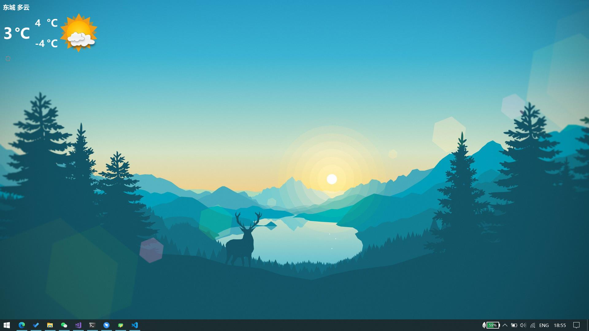

# Pretty Desktop Widgets for Windows
A Beautiful Weather Widget only at the moment. :)

Where you can have a view of the temperature and icon of weather.

## Example View
(look at the top-left)


## Pre-Compiled Excuteble

[Weather-win64](https://github.com/chenyanzz/QtPrettyDesktop/releases/download/v0.1.1/Weather-win64.zip)

> BUT you need to Acquire the "api_key" for yourself (see below)

## Usage

### That "conf.ini"
e.g.
```ini
# window position
x=0
y=0

# window size
width=180
height=200

# the settings of weather
location_large=beijing      # like a province/county
location_small=dongcheng    # like a district

api_key=xxxx-xxxx-xxxxx     # see below

refresh_secs=1800
```


### [VITAL] Acquire the "api_key" for yourself

1. [To Register in qweather.com](https://id.qweather.com/#/login?redirect=https%3A%2F%2Fconsole.qweather.com)

2. [To get the code](https://dev.qweather.com/docs/start/get-api-key/)

### Customize Weather Icons
Just to replace the icons in "WeatherIcons",with the code defined [in this site](https://dev.qweather.com/docs/start/icons/).

(e.g., you can replace the files in folder ```WeatherIcons_set2/``` to folder ```WeatherIcons/```)

> the filename must be ended by ".png"

### Note When you are compiling

Since Qt needs OpenSSL to use ```https://```

Be sure to move the Libraries of ***the correct version*** of OpenSSL to the same folder of the exported ".exe".

Which are: ```libeay32.dll``` and ```ssleay32.dll```

I've left the ```1.0.2j``` version of dlls in ```./lib/```

For other QT versions, you can check the proper version by:

```c++
qDebug()<<QSslSocket::sslLibraryBuildVersionString();
```

## Referrences
- [HeFeng Weather Web Service](https://dev.qweather.com/)
- [HeFeng Weather Icons](https://github.com/qwd/WeatherIcon)
- [Qt5](https://www.qt.io/) (Qt 5.10.1 for my dev, so it may be some errors if you are using another version)
- [OpenSSL](https://www.openssl.org/) for ```https://``` requests 
