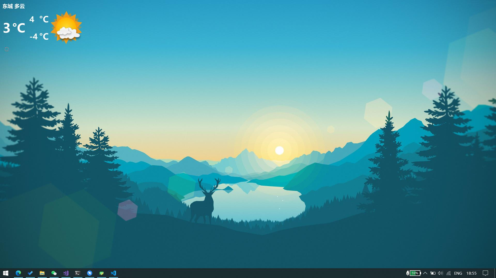

# 基于Qt的Windows桌面美化插件
现在只做了这个天气插件 :)

## 运行截图
（@桌面左上角）


<<<<<<< HEAD
## 预编译的exe
[Weather-win64](https://github.com/chenyanzz/QtPrettyDesktop/releases/download/v0.1.1/Weather-win64.zip)

> 但是需要自己注册、获取"api_key"（方法见下方）


## 使用方法

### 设定配置文件 "conf.ini"
大部分采用默认即可，
e.g.
```ini
# 插件的坐标
x=0
y=0

# 窗口大小
width=180
height=200

# 定位地点设置
location_large=beijing      # 省市
location_small=dongcheng    # 区

api_key=xxxx-xxxx-xxxxx     # 【就是要自己填这个】看下面

refresh_secs=1800 # 刷新间隔（秒）
```


###  【画重点！】 获取"api_key"
1. [注册和风天气开发者](https://id.qweather.com/#/login?redirect=https%3A%2F%2Fconsole.qweather.com)

2. [获取API-KEY步骤](https://dev.qweather.com/docs/start/get-api-key/)

### 自定义天气图标
替换 "WeatherIcons" 目录中的文件即可，文件名含义见[this site](https://dev.qweather.com/docs/start/icons/).

(e.g., 你可以把 ```WeatherIcons_set2/``` 中内容覆盖到 ```WeatherIcons/``` 目录来换一种风格)

> 注意文件名应当是 【天气id】".png"

### 如果要编译源码

由于 Qt 需要 OpenSSL 库才能使用协议 ```https://```

确保将 ***正确版本*** 的 OpenSSL 动态链接库拷贝到 ".exe" 同级目录.

对于我的版本，库文件是: ```libeay32.dll``` 和```ssleay32.dll```

我将 ```1.0.2j``` 的 dlls 保存在了 ```./lib/```

对于其他Qt版本，可能使用不同版本的OPENSSL，你可以通过如下代码查询当前的Qt编译时使用的版本：

```c++
qDebug()<<QSslSocket::sslLibraryBuildVersionString();
```

## 引用
- [和风天气API](https://dev.qweather.com/)
- [和风天气官方图标集](https://github.com/qwd/WeatherIcon)
- [Qt5](https://www.qt.io/) (我用的是5.10.1，其他版本可能会有兼容性问题)
- [OpenSSL](https://www.openssl.org/) 为适配```https://``` 请求
